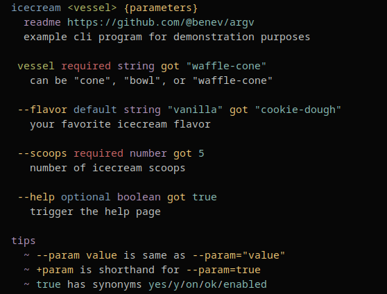

# 🎛️ `@benev/argv`

***command line argument parser***

🤖 for making node cli programs  
💁 help page auto-generated  
🕵️‍♂️ designed for proper typescript typings  
🧼 zero dependencies  
💖 made free and open source, just for you  

<br/>

## example generated help page

```sh
$ icecream waffle-cone --flavor cookie-dough --scoops 5
```



<br/>

## instructions

1. install `@benev/argv` via npm
    ```sh
    npm install @benev/argv
    ```
1. import the cli function
    ```ts
    import {cli} from "@benev/argv"
    ```
1. formalize types for your arguments and parameters
    ```ts
    export type Args = {
      environment: string
      suite: string
    }

    export type Params = {
      "--label": string
      "--verbose": boolean
      "--port": number
    }
    ```
1. specify your cli, and perform the parsing
    ```ts
    const {args, params} = cli<Args, Params>()({
      program: "icecream",
      argv: process.argv,
      columns: process.stdout.columns ?? 72,

      // positional arguments your program will accept
      argorder: ["vessel"],

      // arguments your program will accept
      args: {
        vessel: {
          type: String,
          mode: "requirement",
          help: 'can be "cone", "bowl", or "waffle-cone"',
        },
      },

      // parameters your program will accept
      params: {
        "--flavor": {
          type: String,
          mode: "default",
          default: "vanilla",
          help: "your favorite icecream flavor",
        },
        "--scoops": {
          type: Number,
          mode: "requirement",
          help: "number of icecream scoops",
        },
        "--help": {
          mode: "option",
          type: Boolean,
          help: "trigger the help page",
        },
      },
    })
    ```
1. now you can access your args and params
    ```js
    // example command:
    //  $ icecream waffle-cone --flavor cookie-dough --scoops 5

    args.vessel
      // "waffle-cone"

    params["--flavor"]
      // "cookie-dough"

    params["--scoops"]
      // 5
    ```

<br/>

## notes

- argv uses exact names, like `--param`, so the typescript typings work.
- typings work best if you declare `Args` and `Params` types, but it can infer some of it if you omit them.
- these are equivalent ways to pass a param:
  - `--param true`
  - `--param "true"`
  - `--param=true`
  - `--param="true"`
  - `+param` *(sets to boolean true)*
- boolean parsing regards these as `true` (case-insensitive):
  - `"true"`
  - `"yes"`
  - `"y"`
  - `"on"`
  - `"ok"`
  - `"enabled"`
